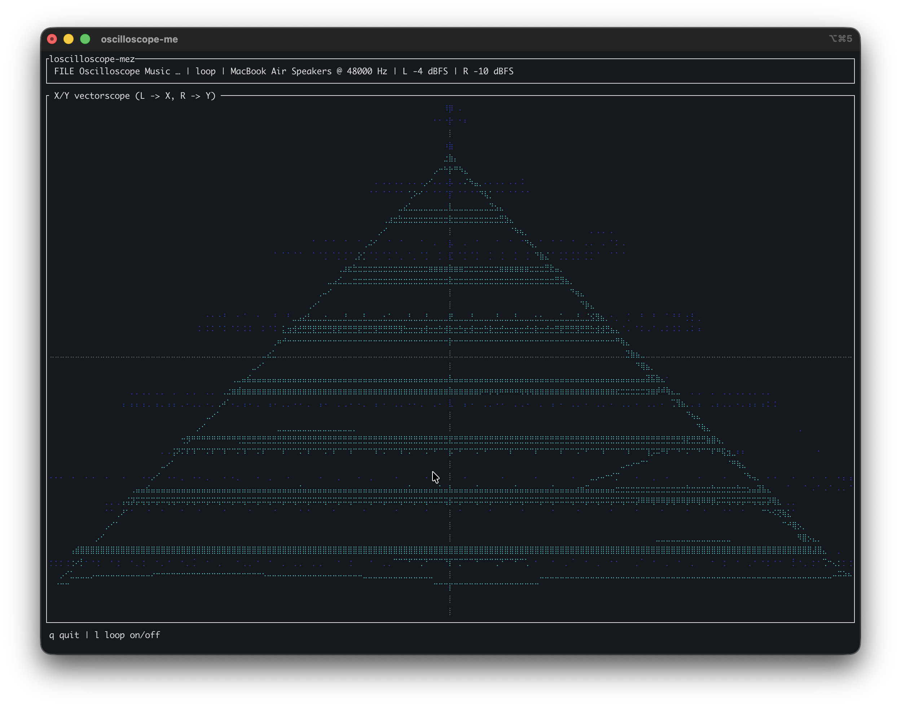

# oscilloscope-me

FM SDR receiver with a terminal **X/Y vectorscope** for [oscilloscope music](https://oscilloscopemusic.com/). Tune an FM station (e.g. ToorCamp's LOL radio), preview Lissajous shapes in the terminal, and output stereo L/R audio for an analog oscilloscope in XY mode.



## Hardware

- **SDR:** RTL-SDR compatible dongle (tested target: NooElec NESDR Smart v5 — RTL2832U + R820T2/R860)
- **Antenna:** FM band antenna
- **Optional:** Analog oscilloscope in XY mode, shielded stereo audio cable (192 kHz capable)
- **Note:** Laptop headphone jacks are AC-coupled; images may drift on an analog scope. A DC-coupled USB DAC gives better results.

### Scope wiring

1. Set oscilloscope to **XY mode**
2. **Left audio → X input**
3. **Right audio → Y input**

## Install

### macOS (Apple Silicon)

```bash
brew install libusb pkg-config
cargo build --release
```

### Linux

```bash
# Debian/Ubuntu
sudo apt install libusb-1.0-0-dev pkg-config libasound2-dev cargo

# Fedora
sudo dnf install libusb1-devel pkg-config libasound2-dev cargo

cargo build --release
```

#### USB permissions (Linux)

```bash
sudo cp udev/99-rtlsdr.rules /etc/udev/rules.d/
sudo udevadm control --reload-rules
sudo udevadm trigger
sudo usermod -aG plugdev "$USER"
# log out and back in
```

If you see `Usb(Busy)`, the kernel DVB driver may be claiming the dongle:

```bash
sudo rmmod rtl2832_sdr dvb_usb_rtl28xxu rtl2832 rtl8xxxu
```

For a permanent fix, blacklist those modules (see [rtl-sdr-rs Linux notes](https://github.com/ccostes/rtl-sdr-rs#linux-kernel-modules)).

## Usage

```bash
cargo run --release
```

**If you hear static**, try the proven mono demod path (same algorithm as `rtl_fm`):

```bash
cargo run --release -- --mono -f 92.5
```

Stereo / scope mode:

```bash
cargo run --release -- -f 92.5
```

1. Plug in the SDR — the app waits until one is detected
2. Tunes **92.5 MHz** by default (override with `-f`)
3. Terminal shows a live X/Y vectorscope; audio plays on the default output device

### File playback (no SDR)

Play an [oscilloscope music](https://oscilloscopemusic.com/) MP3 directly — left channel drives X, right channel drives Y. Useful for testing the vectorscope and driving an analog scope without tuning FM.

```bash
cargo run --release -- --file path/to/oscilloscope-music.mp3
```

Playback **loops** by default. Press `l` in the app to toggle loop, or pass `--no-loop` to play once.

### Options

```
oscilloscope-me [OPTIONS]

  -f, --freq <MHZ>           FM frequency in MHz (default: 92.5)
  -g, --gain <DB|auto>       Tuner gain (default: auto)
      --mono                 Start in mono decode mode
  -a, --audio-device <NAME>  Output device name substring
  -r, --sample-rate <HZ>     Target output rate (default: 48000)
      --ppm <PPM>            Frequency correction (default: 0)
      --file <PATH>          Play oscilloscope music MP3 (L=X, R=Y)
      --no-loop              Don't loop file playback
```

### In-app keys

| Key | Action |
|-----|--------|
| `q` / `Esc` | Quit |
| `+` / `=` | Tune +0.1 MHz (SDR only) |
| `-` | Tune −0.1 MHz (SDR only) |
| `g` | Cycle gain (SDR only) |
| `m` | Toggle mono / stereo decode (SDR only) |
| `l` | Toggle loop (file mode only) |

## How it works

```
RTL-SDR IQ → FM quadrature demod → stereo MPX decode (19 kHz pilot)
          → rtl_fm decimate to 48 kHz → de-emphasis → L/R audio (cpal)
          → decimated scope samples → terminal vectorscope (~60 FPS)
```

Internal MPX processing runs at **170 kHz**. Audio is decimated to **48 kHz** (rtl_fm integer ratio) before de-emphasis and playback. The vectorscope uses a short rolling window with auto-scaling so Lissajous shapes stay crisp.

## License

GPL-3.0-or-later. Uses [rtl-sdr-rs](https://github.com/ccostes/rtl-sdr-rs) (MPL-2.0).
